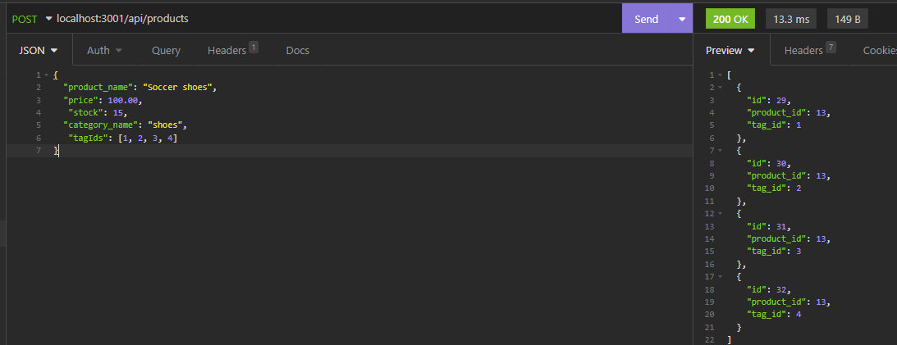

# Note Taker Express

* [GitHub repository](https://github.com/luizborges146/E-commerce) Link to the repository<br />
* [Video Link](https://drive.google.com/file/d/1iQaqSz7WnZ1RQO_yTLgyJlmwUFSkYyPl/view) This is the video showing the application<br />

 [](https://opensource.org/licenses/MIT)


    
## Table of Contents
    
1.  [Description](#description)
2.  [Instalation](#instalation)
3.  [Usage Infomration](#usage)
4.  [External support documentation](#externalDoc)
5.  [Tests](#tests)
6.  [Social](#social)
7.  [Plugins](#plugins)
8.  [License](#license)
    
## [Description](#description)
The idea of this application is to be able to manipulate the data using routes from express, with that in mind, the user can choose from checking PRODUCTS, CATEGORIES and TAGs, not only checking the description, the user can also Create, Update and Delete from the database. The idea is to support companies that use stock to control their inventory, as the appliaction also controls stock and price for the products.

The main idea is to have an organized system where the user can add categories, and under categories add items, so they can easily visualize where items are and check the stock for that specific item. 




## [Instalation](#instalation)
In order to use test this application, you need to create a create an .env file and add you SQL information to it, once it is done, you will be able to run the db/schema that contain the name of the database.

Then one seeds folder, there are a data sample that can be used to test the application.
    
## [Usage](#usage)
Simple to use.
 * Functionalities.
   * Check all Products, Categories and Tags.
   * Check for a specific Product, Category and Tag.
   * Create a new Product, Category and Tag
   * Update Product, Category and Tag
   * Delete Product, Category and Tag.


#### The route below is a get request to identify a specific category ID
```
router.get('/:id',async (req, res) => {
  // find one category by its `id` value
  try {
    const category = await Category.findOne({
    where:{
      id:req.params.id
    },
    // be sure to include its associated Products
    includ:[
      {
        model:Product,
        attributes:["id","product_name","price","stock","category_id"]
      }
    ]
  });
  if (!category) {
    // Client error responses
    res.status(404).json({message:"No product found with this ID"});
    return;
  }
  // Successful responses
  res.status(200).json(category);
  } catch (err) {
    // Server error responses
    res.status(500).json(err);
  }
});
```

  

## [External support documentation](#externalDoc)
    

- [W3School](https://www.w3schools.com/)<br />
- [Mozilla](https://developer.mozilla.org)<br />
- [READ.me](https://docs.readme.com/docs/linking-to-pages")<br />
- [GitHub](https://pages.github.com/)<br />
- [npm inquirer GitHub link](https://github.com/SBoudrias/Inquirer.js/blob/master/README.md#installation)<br />
- [npm mysql](https://www.npmjs.com/package/mysql2)<br />
- [npm](https://www.npmjs.com/)<br />
- [Template Literals](https://developer.mozilla.org/en-US/docs/Web/JavaScript/Reference/Template_literals)<br />
- [NodeJs - Path.join](https://nodejs.org/api/path.html#pathjoinpaths)<br />

    
## [Tests](#tests)
N/A
    
## [Social](#social)
if you need any further information or support, please, send an email to: luiz.borges.146@gmail.com
    
[](https://github.com/luizborges146) [](https://www.linkedin.com/in/luiz-borges-2377b7142/)
    
    
    
## [Plugins](#plugins)
N/A
    
## [License](#license)
License Information: [MIT](https://opensource.org/licenses/MIT);

Created by Luiz Borges
Please refer to the LICENSE in the repo.
